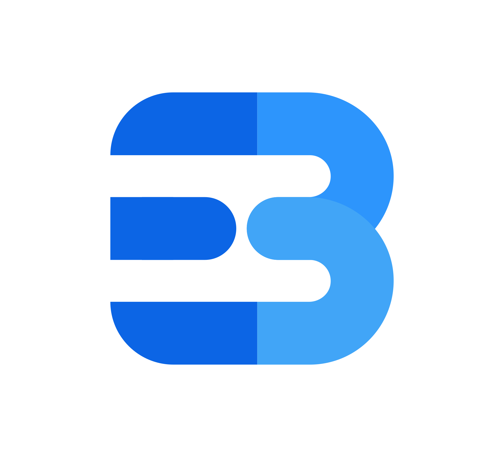

<a name="readme-top"></a>

# Evan Becker's Site
[![Stargazers][stars-shield]][stars-url]
[![Issues][issues-shield]][issues-url]
[![LinkedIn][linkedin-shield]][linkedin-url]
##

<br />
<div align="center">
  <a href="https://github.com/othneildrew/Best-README-Template">
    
  </a>

  <h3 align="center">www.evanbecker.net</h3>

  <p align="center">
    My personal blog site, deployment dashboard, & release location.
    <br />
    <a href="https://github.com/othneildrew/Best-README-Template"><strong>Explore the blog »</strong></a>
    <br />
    <br />
    <a href="https://github.com/othneildrew/Best-README-Template">View Projects</a>
    ·
    <a href="https://github.com/othneildrew/Best-README-Template/issues">Contact Me</a>
    ·
    <a href="https://github.com/othneildrew/Best-README-Template/issues">Test Environment</a>
  </p>
</div>

### Built With
* [![Next][Next.js]][Next-url]
* [![React][React.js]][React-url]
* [![Dotnet][Dotnet]][Dotnet-url]
* [![Postgres][Postgres]][Postgres-url]
* [![GitHub][GitHub]][Github-url]
* [![DigitalOcean][DigitalOcean]][DigitalOcean-url]

<p align="right">(<a href="#readme-top">back to top</a>)</p>

## Contact

Evan Becker - <a href="https://www.linkedin.com/in/evanbeckerdotnet/">LinkedIn</a> - <a href="https://www.evanbecker.net">Website</a> - <a href="mailto:me@evanbecker.net">Email</a>

<p align="right">(<a href="#readme-top">back to top</a>)</p>


## Notes

```sh
Last login: Fri Oct  6 03:39:18 2023 from 104.231.225.84
root@evanbecker-droplet:~# mkdir /etc/traefik
root@evanbecker-droplet:~# vim /etc/traefik/traefik.yaml
root@evanbecker-droplet:~# cat /etc/traefik/traefik.yaml
tls:
  certificates:
    - certFile: /certs/evanbecker.net.crt
      keyFile: /certs/evanbecker.net.key
  stores:
    default:
      defaultCertificate:
        certFile: /certs/evanbecker.net.crt
        keyFile: /certs/evanbecker.net.key
```

<p align="right">(<a href="#readme-top">back to top</a>)</p>

[issues-shield]: https://img.shields.io/github/issues/othneildrew/Best-README-Template.svg?style=for-the-badge
[issues-url]: https://github.com/Evanflow-Studio/www.evanbecker.net/issues
[stars-shield]: https://img.shields.io/github/stars/othneildrew/Best-README-Template.svg?style=for-the-badge
[stars-url]: https://github.com/Evanflow-Studio/www.evanbecker.net/stargazers
[linkedin-shield]: https://img.shields.io/badge/-LinkedIn-black.svg?style=for-the-badge&logo=linkedin&colorB=555
[linkedin-url]: https://www.linkedin.com/in/evanbeckerdotnet/
[Next.js]: https://img.shields.io/badge/next.js-000000?style=for-the-badge&logo=nextdotjs&logoColor=white
[Next-url]: https://nextjs.org/
[React.js]: https://img.shields.io/badge/React-20232A?style=for-the-badge&logo=react&logoColor=61DAFB
[React-url]: https://reactjs.org/
[Dotnet]: https://img.shields.io/badge/.NET-5C2D91?style=for-the-badge&logo=.net&logoColor=white
[Dotnet-url]: https://dotnet.microsoft.com/en-us/download
[Postgres]: https://img.shields.io/badge/PostgreSQL-316192?style=for-the-badge&logo=postgresql&logoColor=white
[Postgres-url]: https://www.postgresql.org/
[DigitalOcean]: https://img.shields.io/badge/Digital_Ocean-0080FF?style=for-the-badge&logo=DigitalOcean&logoColor=white
[DigitalOcean-url]: https://www.digitalocean.com/?style=for-the-badge
[GitHub]: https://img.shields.io/badge/GitHub_Actions-2088FF?style=for-the-badge&logo=github-actions&logoColor=white
[GitHub-url]: https://github.com/