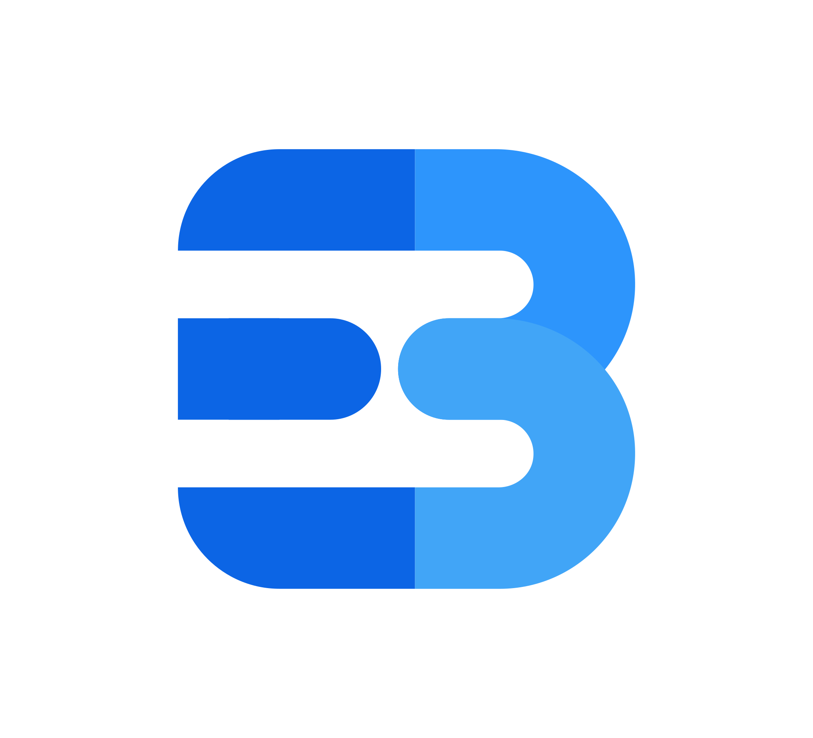
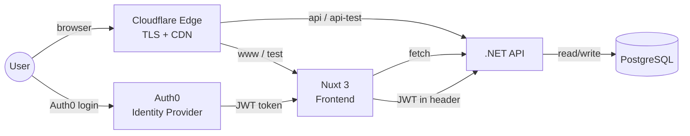
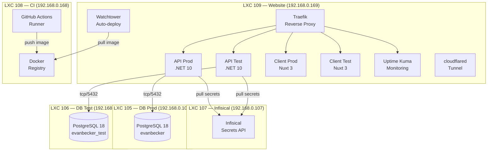
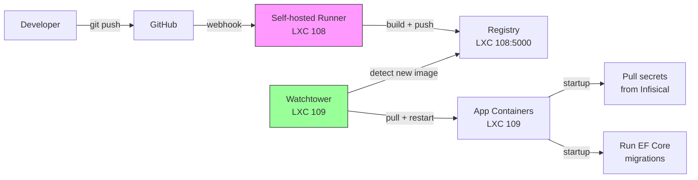

<a name="readme-top"></a>

# www.evanbecker.net

[![Stars][stars-shield]][stars-url]
[![Issues][issues-shield]][issues-url]
[![LinkedIn][linkedin-shield]][linkedin-url]

<br />
<div align="center">
  <a href="https://www.evanbecker.net">
    
  </a>

  <h3 align="center">www.evanbecker.net</h3>

  <p align="center">
    A full-stack personal portfolio, blog, and contact platform — self-hosted on a Proxmox homelab.
    <br />
    <a href="https://www.evanbecker.net/articles"><strong>Read the Blog &raquo;</strong></a>
    <br />
    <br />
    <a href="https://www.evanbecker.net/projects">Projects</a>
    &middot;
    <a href="https://www.evanbecker.net/contact">Contact</a>
    &middot;
    <a href="https://health.evanbecker.net/status/main">Status</a>
  </p>
</div>

---

## About

This is the monorepo powering [evanbecker.net](https://www.evanbecker.net) — a personal site with blog articles (written in Markdown), an authenticated commenting system, a contact form, newsletter signup, and a projects showcase. The frontend is a Nuxt 3 application and the backend is a .NET API backed by PostgreSQL.

The entire stack is self-hosted on a Proxmox VE homelab with isolated LXC containers, Cloudflare Tunnel for zero-open-port ingress, and Infisical for secrets management.

## Built With

* [![Nuxt][Nuxt.js]][Nuxt-url]
* [![Vue][Vue.js]][Vue-url]
* [![TypeScript][TypeScript]][TypeScript-url]
* [![TailwindCSS][TailwindCSS]][TailwindCSS-url]
* [![Dotnet][Dotnet]][Dotnet-url]
* [![Postgres][Postgres]][Postgres-url]
* [![Docker][Docker]][Docker-url]
* [![GitHub Actions][GitHub]][Github-url]
* [![Proxmox][Proxmox]][Proxmox-url]
* [![Cloudflare][Cloudflare]][Cloudflare-url]

<p align="right">(<a href="#readme-top">back to top</a>)</p>

---

## Architecture

### Application Flow


```mermaid
graph LR
    User((User)) -->|browser| CF[Cloudflare Edge<br/>TLS + CDN]
    CF -->|www / test| Client[Nuxt 3<br/>Frontend]
    CF -->|api / api-test| API[.NET API]
    Client -->|fetch| API
    API -->|read/write| DB[(PostgreSQL)]
    User -->|Auth0 login| Auth0[Auth0<br/>Identity Provider]
    Auth0 -->|JWT token| Client
    Client -->|JWT in header| API
```

### Service Topology


```mermaid
graph TB
    subgraph LXC109["LXC 109 — Website (192.168.0.169)"]
        direction TB
        Traefik[Traefik<br/>Reverse Proxy]
        APIProd[API Prod<br/>.NET 10]
        APITest[API Test<br/>.NET 10]
        ClientProd[Client Prod<br/>Nuxt 3]
        ClientTest[Client Test<br/>Nuxt 3]
        Kuma[Uptime Kuma<br/>Monitoring]
        Watchtower[Watchtower<br/>Auto-deploy]
        CFD109[cloudflared<br/>Tunnel]

        Traefik --> APIProd
        Traefik --> APITest
        Traefik --> ClientProd
        Traefik --> ClientTest
        Traefik --> Kuma
    end

    subgraph LXC107["LXC 107 — Infisical (192.168.0.107)"]
        Infisical[Infisical<br/>Secrets API]
    end

    subgraph LXC108["LXC 108 — CI (192.168.0.168)"]
        Runner[GitHub Actions<br/>Runner]
        Registry[Docker<br/>Registry]
    end

    subgraph LXC105["LXC 105 — DB Prod (192.168.0.105)"]
        PGProd[(PostgreSQL 18<br/>evanbecker)]
    end

    subgraph LXC106["LXC 106 — DB Test (192.168.0.106)"]
        PGTest[(PostgreSQL 18<br/>evanbecker_test)]
    end

    APIProd -->|tcp/5432| PGProd
    APITest -->|tcp/5432| PGTest
    APIProd -->|pull secrets| Infisical
    APITest -->|pull secrets| Infisical
    Runner -->|push image| Registry
    Watchtower -->|pull image| Registry
```

### Deployment Pipeline


```mermaid
graph LR
    Dev[Developer] -->|git push| GH[GitHub]
    GH -->|webhook| Runner[Self-hosted Runner<br/>LXC 108]
    Runner -->|build + push| Registry[Registry<br/>LXC 108:5000]
    Watchtower[Watchtower<br/>LXC 109] -->|detect new image| Registry
    Watchtower -->|pull + restart| Containers[App Containers<br/>LXC 109]
    Containers -->|startup| Infisical[Pull secrets<br/>from Infisical]
    Containers -->|startup| Migrate[Run EF Core<br/>migrations]

    style Runner fill:#f9f,stroke:#333
    style Watchtower fill:#9f9,stroke:#333
```

| Branch | Deploys To | Image Tag | URL |
|--------|-----------|-----------|-----|
| `develop` | Test | `:test` | test.evanbecker.net / api-test.evanbecker.net |
| `main` | Production | `:latest` | www.evanbecker.net / api.evanbecker.net |

No secrets in CI. The API pulls all secrets from Infisical at startup. Migrations run automatically at container startup.

<p align="right">(<a href="#readme-top">back to top</a>)</p>

---

## Repository Structure

```
www.evanbecker.net/
│
├── evanbecker-client/              # Nuxt 3 frontend
│   ├── pages/                      # File-based routing
│   ├── components/                 # Vue components (auto-imported)
│   ├── composables/                # Vue composables
│   ├── content/articles/           # Markdown blog articles
│   ├── layouts/                    # Page layouts
│   ├── assets/                     # CSS, images
│   ├── Dockerfile
│   └── package.json
│
├── evanbecker-api/                 # .NET backend
│   ├── evanbecker-api/             # API project
│   │   ├── Controllers/            # REST endpoints
│   │   ├── Services/               # Business logic
│   │   ├── Configuration/          # Auth0, Infisical config
│   │   ├── Dto/                    # Data transfer objects
│   │   └── Program.cs              # Startup & DI
│   └── evanbecker-domain/          # Data layer
│       ├── Entities/               # EF Core models
│       ├── Migrations/             # Database migrations
│       └── ApplicationContext.cs   # DbContext
│
├── infrastructure/                 # Homelab infrastructure
│   ├── README.md                   # Infrastructure overview
│   ├── adr/                        # Architecture Decision Records
│   ├── database-lxc-setup.md       # LXC 105/106 — PostgreSQL
│   ├── infisical-lxc-setup.md      # LXC 107 — Secrets management
│   ├── ci-lxc-setup.md             # LXC 108 — CI/CD
│   ├── website-lxc-setup.md        # LXC 109 — App stack
│   └── scripts/                    # One-shot LXC install scripts
│
├── .github/workflows/              # CI/CD pipelines
│   ├── build-and-push-to-prod.yml  # main → prod (:latest)
│   ├── build-and-push-to-test.yml  # develop → test (:test)
│   └── dotnet-pull_request.yml     # PR build validation
│
├── docker-compose.yaml             # Local development
└── docker-compose.production.yaml  # Production (LXC 109)
```

<p align="right">(<a href="#readme-top">back to top</a>)</p>

---

## Getting Started

### Prerequisites

- [Docker](https://docs.docker.com/get-docker/) & Docker Compose
- [Node.js 20+](https://nodejs.org/) (for frontend-only dev)
- [.NET 10 SDK](https://dotnet.microsoft.com/download) (for API-only dev)

### Quick Start (Full Stack)

1. **Clone the repo:**
   ```bash
   git clone https://github.com/Evanflow-Studio/www.evanbecker.net.git
   cd www.evanbecker.net
   ```

2. **Set up environment variables:**
   ```bash
   cp .env.example .env
   cp evanbecker-client/.env.example evanbecker-client/.env.local
   ```
   Fill in your Auth0 credentials, database credentials, and API URLs.

3. **Start all services:**
   ```bash
   docker compose up --build
   ```

4. **Open in your browser:**
   - Frontend: [http://localhost:3000](http://localhost:3000)
   - API + Swagger: [http://localhost:5002/swagger](http://localhost:5002/swagger)
   - Traefik Dashboard: [http://localhost:6969](http://localhost:6969)

### Frontend Only

```bash
cd evanbecker-client
npm install
npm run dev
```

### API Only

```bash
cd evanbecker-api/evanbecker-api
dotnet run
```

<p align="right">(<a href="#readme-top">back to top</a>)</p>

---

## API Reference

Base path: `/api/v1/`

| Endpoint | Method | Auth | Description |
|---|---|---|---|
| `comment/{targetLocation}` | GET | No | Get comments for a page |
| `comment/{targetLocation}` | POST | Required | Post a new comment |
| `comment/{targetLocation}/reply/{commentId}` | POST | Required | Reply to a comment |
| `comment/{id}` | DELETE | Required | Soft-delete a comment |
| `contact` | POST | No | Submit a contact message |
| `newsletter` | POST | No | Subscribe to newsletter |
| `user` | GET | Required | Get authenticated user info |

Full interactive docs available via Swagger at `/swagger` on any running API instance.

<p align="right">(<a href="#readme-top">back to top</a>)</p>

---

## Deployment

See [`infrastructure/README.md`](infrastructure/README.md) for full deployment documentation including:
- LXC container inventory and setup guides
- Branch strategy and CI/CD pipeline details
- Secrets management (Infisical)
- Monitoring (Uptime Kuma)
- Network security and firewall configuration
- Architecture Decision Records

<p align="right">(<a href="#readme-top">back to top</a>)</p>

---

## Features

- **Blog** — Markdown-powered articles with syntax-highlighted code blocks via Nuxt Content
- **Commenting System** — Auth0-authenticated comments with nested replies on articles
- **Contact Form** — Submissions stored in PostgreSQL
- **Newsletter** — Email subscription signup
- **Projects Showcase** — Portfolio of work
- **Dark/Light Mode** — Theme toggle via @nuxtjs/color-mode
- **RSS Feed** — Auto-generated at `/feed.xml`
- **Responsive Design** — Tailwind CSS with mobile-first approach
- **Self-Hosted Infrastructure** — No cloud dependencies beyond DNS and auth
- **Status Page** — Public uptime monitoring at [health.evanbecker.net](https://health.evanbecker.net/status/main)

---

## Contact

**Evan Becker**

- [LinkedIn](https://www.linkedin.com/in/evanbeckerdotnet/)
- [Website](https://www.evanbecker.net)
- [Email](mailto:me@evanbecker.net)

Project Link: [https://github.com/Evanflow-Studio/www.evanbecker.net](https://github.com/Evanflow-Studio/www.evanbecker.net)

<p align="right">(<a href="#readme-top">back to top</a>)</p>

---

<!-- Badge references -->
[issues-shield]: https://img.shields.io/github/issues/Evanflow-Studio/www.evanbecker.net.svg?style=for-the-badge
[issues-url]: https://github.com/Evanflow-Studio/www.evanbecker.net/issues
[stars-shield]: https://img.shields.io/github/stars/Evanflow-Studio/www.evanbecker.net.svg?style=for-the-badge
[stars-url]: https://github.com/Evanflow-Studio/www.evanbecker.net/stargazers
[linkedin-shield]: https://img.shields.io/badge/-LinkedIn-black.svg?style=for-the-badge&logo=linkedin&colorB=555
[linkedin-url]: https://www.linkedin.com/in/evanbeckerdotnet/

<!-- Tech badges -->
[Nuxt.js]: https://img.shields.io/badge/Nuxt-00DC82?style=for-the-badge&logo=nuxtdotjs&logoColor=white
[Nuxt-url]: https://nuxt.com/
[Vue.js]: https://img.shields.io/badge/Vue.js-4FC08D?style=for-the-badge&logo=vuedotjs&logoColor=white
[Vue-url]: https://vuejs.org/
[TypeScript]: https://img.shields.io/badge/TypeScript-3178C6?style=for-the-badge&logo=typescript&logoColor=white
[TypeScript-url]: https://www.typescriptlang.org/
[TailwindCSS]: https://img.shields.io/badge/Tailwind_CSS-06B6D4?style=for-the-badge&logo=tailwindcss&logoColor=white
[TailwindCSS-url]: https://tailwindcss.com/
[Dotnet]: https://img.shields.io/badge/.NET-5C2D91?style=for-the-badge&logo=.net&logoColor=white
[Dotnet-url]: https://dotnet.microsoft.com/
[Postgres]: https://img.shields.io/badge/PostgreSQL-316192?style=for-the-badge&logo=postgresql&logoColor=white
[Postgres-url]: https://www.postgresql.org/
[Docker]: https://img.shields.io/badge/Docker-2496ED?style=for-the-badge&logo=docker&logoColor=white
[Docker-url]: https://www.docker.com/
[GitHub]: https://img.shields.io/badge/GitHub_Actions-2088FF?style=for-the-badge&logo=github-actions&logoColor=white
[GitHub-url]: https://github.com/features/actions
[Proxmox]: https://img.shields.io/badge/Proxmox-E57000?style=for-the-badge&logo=proxmox&logoColor=white
[Proxmox-url]: https://www.proxmox.com/
[Cloudflare]: https://img.shields.io/badge/Cloudflare-F38020?style=for-the-badge&logo=cloudflare&logoColor=white
[Cloudflare-url]: https://www.cloudflare.com/
