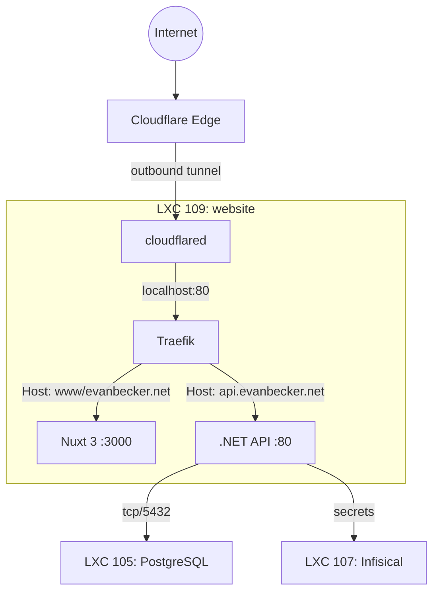

# Website LXC Setup Guide (Nuxt 3 + .NET API + Traefik + Cloudflare Tunnel)

LXC 109 runs the full website stack via Docker Compose: Traefik reverse proxy, Nuxt 3 client, .NET 10 API, and Cloudflare Tunnel (cloudflared). The API connects to PostgreSQL on LXC 105. Cloudflared runs as a sidecar container — no separate LXC needed.

## Architecture



All internet traffic enters through the outbound-only Cloudflare Tunnel — no ports are open on the homelab. Cloudflared is a Docker container alongside the app, communicating with Traefik over the internal Docker network.

---

## Quick Start

### 1. Transfer the script to your Proxmox host

```bash
scp infrastructure/scripts/setup-website.sh root@<PROXMOX_IP>:/root/
```

### 2. Create a Cloudflare Tunnel (before running the script)

1. Go to [Cloudflare Zero Trust dashboard](https://one.dash.cloudflare.com/)
2. Navigate to **Networks → Tunnels → Create a tunnel**
3. Choose **Cloudflared** as the connector type
4. Name it `homelab-tunnel`
5. On the install page, copy the **tunnel token** (the long string after `--token`)
6. **Do not install** cloudflared on the suggested machine — the script handles this

### 3. Run the setup

```bash
ssh root@<PROXMOX_IP>
chmod +x setup-website.sh
./setup-website.sh
```

The script will:
- Auto-detect your network (subnet, gateway)
- Prompt for the LXC root password and Cloudflare tunnel token
- Show a confirmation summary before doing anything
- Create LXC 109, install Docker, .NET SDK 10.0, Node.js 20, and git
- Clone the repository to `/opt/app`
- Create a Docker Compose config with Traefik, API, client, and cloudflared
- Configure Proxmox firewall (LAN access only, outbound allow)

### 4. Configure environment variables

After the script completes, fill in the `.env` file:

```bash
pct enter 109
nano /opt/docker/.env
```

| Variable | Description | Example |
|---|---|---|
| `DB_CONNECTION_STRING` | PostgreSQL on LXC 105 | `Host=<LXC105_IP>;Port=5432;Database=evanbecker;Username=evanbecker_app;Password=<PW>;` |
| `AUTH0_DOMAIN` | Auth0 tenant domain | `evanbecker.us.auth0.com` |
| `AUTH0_AUDIENCE` | Auth0 API audience | `https://api.evanbecker.net` |
| `AUTH0_CLIENT_ID` | Auth0 application ID | `abc123...` |
| `AUTH0_CLIENT_SECRET` | Auth0 client secret | `xyz789...` |
| `AUTH0_REDIRECT_URI` | Post-login redirect | `https://www.evanbecker.net` |
| `GITHUB_PAT` | GitHub personal access token | `ghp_...` |
| `GITHUB_ORGANIZATION` | GitHub org name | `Evanflow-Studio` |
| `SITE_URL` | Public site URL | `https://www.evanbecker.net` |
| `API_URL` | Public API URL | `https://api.evanbecker.net` |
| `TUNNEL_TOKEN` | Cloudflare tunnel token | (auto-filled if provided during setup) |

These will eventually be managed by Infisical (LXC 107).

### 5. Build and start the stack

```bash
pct enter 109
cd /opt/docker
docker compose up -d --build
```

The first build will take several minutes (downloading base images, npm install, dotnet restore).

### 6. Configure Cloudflare Tunnel routes

After the stack is running, configure public hostname routes in the **Cloudflare Zero Trust dashboard**:

**Networks → Tunnels → your tunnel → Public Hostname → Add**

| Public hostname | Service | Notes |
|---|---|---|
| `www.evanbecker.net` | `http://cloudflared:80` | Traefik routes to Nuxt 3 |
| `evanbecker.net` | `http://cloudflared:80` | Traefik routes to Nuxt 3 |
| `api.evanbecker.net` | `http://cloudflared:80` | Traefik routes to .NET API |
| `test.evanbecker.net` | `http://cloudflared:80` | Traefik routes to test Nuxt 3 |
| `api-test.evanbecker.net` | `http://cloudflared:80` | Traefik routes to test .NET API |

> Since cloudflared and Traefik are on the same Docker network, routes point to Traefik's container. Use `http://traefik:80` or the LXC's internal IP. Traefik handles hostname-based routing to the correct backend.

### 7. Add LXC 109 to the database firewall

Add LXC 109's IP to the `db-prod-clients` IP Set in the Proxmox UI so the API can reach PostgreSQL on LXC 105.

```bash
# Get LXC 109's IP
pct config 109 | grep net0 | grep -oP 'ip=\K[^/]+'
```

Then: **Datacenter → Firewall → IPSet → db-prod-clients → Add** the IP.

---

## What the Script Configures

| Setting | Value |
|---|---|
| CTID | 109 |
| Hostname | `website` |
| Cores | 4 |
| Memory | 4096 MB |
| Swap | 1024 MB |
| Rootfs | 32 GB on local-lvm |
| cpuunits | 2048 (highest priority) |
| Features | nesting=1 (required for Docker) |
| Firewall | LAN inbound 80/443 only; outbound ACCEPT |
| Internet | Kept (cloudflared, npm, docker pulls, git) |

### Docker Compose services

| Container | Image | Purpose |
|---|---|---|
| `traefik` | traefik:v3.3 | Reverse proxy, hostname-based routing |
| `evanbecker-api` | Built from repo | .NET 10 REST API |
| `evanbecker-client` | Built from repo | Nuxt 3 15 frontend |
| `cloudflared` | cloudflare/cloudflared:latest | Tunnel to Cloudflare edge (outbound-only) |

### Installed software (directly in LXC)

| Software | Purpose |
|---|---|
| Docker + Docker Compose | Container runtime |
| Git | Clone and update the repo |
| .NET SDK 10.0 | Run EF Core migrations |
| Node.js 20 | Frontend dev (optional, mainly for debugging) |

---

## Cloudflare Access (SSO Gate for Private Services)

Cloudflare Access lets you expose internal services through the tunnel with authentication — no VPN needed.

### Setting Up Auth0 as Identity Provider

1. Go to [Cloudflare Zero Trust dashboard](https://one.dash.cloudflare.com/)
2. Navigate to **Settings → Authentication → Login methods**
3. Click **Add new** and select **Auth0**
4. Enter your Auth0 domain, client ID, and client secret
5. Save

### Creating Access Policies

For each private service you want to protect:

1. Add a public hostname to the tunnel (e.g., `secrets.evanbecker.net → http://192.168.0.107:8080`)
2. Go to **Access → Applications → Add an application**
3. Choose **Self-hosted**
4. Set the application domain (e.g., `secrets.evanbecker.net`)
5. Add a policy: **Allow** → **Include** → **Emails** → `your-email@example.com`

### Example Private Services

| Service | Hostname | Origin | Notes |
|---|---|---|---|
| Infisical | `secrets.evanbecker.net` | `http://192.168.0.107:8080` | Secrets management UI |
| Proxmox UI | `proxmox.evanbecker.net` | `https://192.168.0.47:8006` | Enable "No TLS Verify" (self-signed cert) |

> Private service routes point directly to the LXC IP since cloudflared can reach any host on the `192.168.0.x` network from inside LXC 109.

---

## Image Build Strategy

**Current approach:** Images are built locally on LXC 109 from the cloned repo at `/opt/app`. The docker-compose.yaml uses `build:` directives pointing to the local Dockerfiles.

**Future approach:** Once the CI LXC (108) with runner and Docker registry is set up, the compose file will switch to pulling pre-built images:

```yaml
# Future: pull from local registry instead of building
api:
  image: 192.168.0.168:5000/evanbecker-api:latest
client:
  image: 192.168.0.168:5000/evanbecker-client:latest
```

---

## EF Core Migrations

The .NET SDK is installed directly in the LXC so you can run Entity Framework migrations against the production database.

### Run migrations

```bash
pct enter 109

# Install the EF tool (first time only)
dotnet tool install --global dotnet-ef
export PATH="$PATH:/root/.dotnet/tools"

# Run migrations
cd /opt/app/evanbecker-api/evanbecker-domain
dotnet ef database update \
  --connection "Host=<LXC105_IP>;Port=5432;Database=evanbecker;Username=evanbecker_app;Password=<PASSWORD>;" \
  --startup-project ../evanbecker-api/evanbecker-api.csproj
```

### Add a new migration (dev workflow)

Migrations should be created on your dev machine and committed to the repo. On LXC 109, pull the latest code and apply:

```bash
pct enter 109
cd /opt/app && git pull
cd evanbecker-api/evanbecker-domain
dotnet ef database update \
  --connection "Host=<LXC105_IP>;Port=5432;Database=evanbecker;Username=evanbecker_app;Password=<PASSWORD>;" \
  --startup-project ../evanbecker-api/evanbecker-api.csproj
```

---

## Maintenance

### Update the site (rebuild from latest code)

```bash
pct enter 109
cd /opt/app && git pull
cd /opt/docker && docker compose up -d --build
```

### View logs

```bash
pct enter 109
cd /opt/docker

# All services
docker compose logs -f --tail 100

# Specific service
docker compose logs -f api
docker compose logs -f client
docker compose logs -f traefik
docker compose logs -f cloudflared
```

### Check tunnel status

```bash
pct enter 109
docker logs cloudflared 2>&1 | grep "Connection"
# Should show: "Connection <id> registered"
```

Or check the Cloudflare Zero Trust dashboard — the tunnel should show as "Healthy".

### Restart the stack

```bash
pct enter 109
cd /opt/docker && docker compose restart
```

### Rebuild a single service

```bash
pct enter 109
cd /opt/docker && docker compose up -d --build api    # or client
```

### Update cloudflared

```bash
pct enter 109
cd /opt/docker && docker compose pull cloudflared && docker compose up -d cloudflared
```

### Rotate the tunnel token

1. Create a new tunnel in Cloudflare Zero Trust dashboard (or rotate the existing token)
2. Update the `.env` file:

```bash
pct enter 109
nano /opt/docker/.env   # Update TUNNEL_TOKEN
cd /opt/docker && docker compose up -d cloudflared
```

### Clean up Docker disk space

```bash
pct enter 109
docker system prune -a --volumes   # WARNING: removes all unused images and volumes
```

---

## Troubleshooting

### API can't connect to PostgreSQL

1. Check LXC 109's IP is in the `db-prod-clients` IP Set
2. Verify the connection string in `/opt/docker/.env`
3. Test connectivity from inside LXC 109:

```bash
pct enter 109
apt-get install -y postgresql-client   # if not installed
psql "host=<LXC105_IP> port=5432 dbname=evanbecker user=evanbecker_app"
```

### Tunnel shows "Inactive" in Cloudflare dashboard

```bash
pct enter 109
docker ps | grep cloudflared   # Is the container running?
docker logs cloudflared 2>&1 | tail -20
```

If logs show DNS errors, verify the LXC has a nameserver:

```bash
pct config 109 | grep nameserver
# Should show: nameserver: 1.1.1.1
```

### "Connection registered" but sites don't load

The tunnel is working but routes are misconfigured. Check:

1. Public hostnames are configured in the Cloudflare dashboard
2. The origin URLs are correct (should point to `http://traefik:80` or the LXC's IP)
3. Traefik is running: `docker compose logs traefik | grep -i "router"`

### Traefik not routing correctly

```bash
pct enter 109
docker compose logs traefik | grep -i "router"
docker inspect evanbecker-api | grep -A 20 Labels
docker inspect evanbecker-client | grep -A 20 Labels
```

### Build fails (out of disk space)

```bash
pct enter 109
df -h /
docker system df
docker system prune -a
```

### Docker won't start inside the LXC

Verify nesting is enabled:

```bash
pct config 109 | grep features
# Should show: nesting=1
```

---

## File Locations

| File | Location | Purpose |
|---|---|---|
| Install script | `infrastructure/scripts/setup-website.sh` | Run on Proxmox to create LXC 109 |
| Docker Compose | `/opt/docker/docker-compose.yaml` (inside LXC) | Traefik + API + Client + Cloudflared |
| Environment vars | `/opt/docker/.env` (inside LXC) | Secrets, config, and tunnel token |
| Git repo | `/opt/app` (inside LXC) | Cloned source for building |
| Firewall config | `/etc/pve/firewall/109.fw` (on Proxmox host) | Per-LXC firewall rules |
